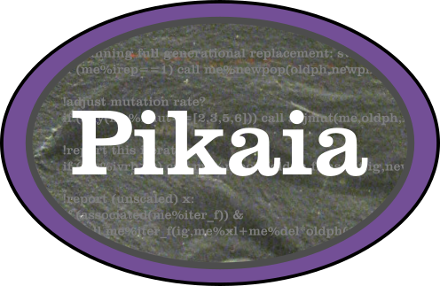

============

**Pikaia**: Modern Fortran Edition of the PIKAIA Genetic Algorithm

### Status

 [](https://github.com/jacobwilliams/pikaia/releases/latest)
[](https://codecov.io/gh/jacobwilliams/pikaia)

### Overview

This is a refactoring of the PIKAIA unconstrained optimization code from the [High Altitude Observatory](http://www.hao.ucar.edu/modeling/pikaia/pikaia.php).  The original code is public domain and was written by Paul Charbonneau & Barry Knapp.  The new code differs from the old code in the following respects:

  * The original fixed-form source (FORTRAN 77) was converted to free-form source.
  * The code is now object-oriented Fortran 2003/2008.  All user interaction is now through the   ```pikaia_class```.
  * All real variables are now double precision.
  * The original random number generator was replaced with MT19937-64 (64-bit Mersenne Twister).
  * There are various new options (e.g., a convergence window with a tolerance can be specified as a   stopping condition, and the user can specify a subroutine for reporting iterations).
  * Mapping the variables to be between 0 and 1 now occurs internally, rather than requiring the user   to do it.
  * Can now include an initial guess in the initial population.
  * Some OpenMP support has been added.

### Compiling

The library can be built with the [Fortran Package Manager](https://github.com/fortran-lang/fpm) using the provided `fpm.toml` file like so:

```bash
fpm build --release
```

To use Pikaia within your fpm project, add the following to your `fpm.toml` file:

```yml
[dependencies]
pikaia = { git="https://github.com/jacobwilliams/pikaia.git" }
```

### Examples

 * An example use of Pikaia can be found [here](http://degenerateconic.com/earth-mars-free-return/).

### Documentation

 * The API documentation for the current ```master``` branch can be found [here](https://jacobwilliams.github.io/pikaia/).  This is generated by processing the source files with [FORD](https://github.com/Fortran-FOSS-Programmers/ford).  Note that the shell script will also generate these files automatically in the ```doc``` folder, assuming you have FORD installed.
 * The original Pikaia documentation (for v1.2) can be found [here](http://www.hao.ucar.edu/modeling/pikaia/relnotes.ps).

### See also

 * PIKAIA description page: http://www.hao.ucar.edu/modeling/pikaia/pikaia.php
 * Original source code: http://download.hao.ucar.edu/archive/pikaia/

